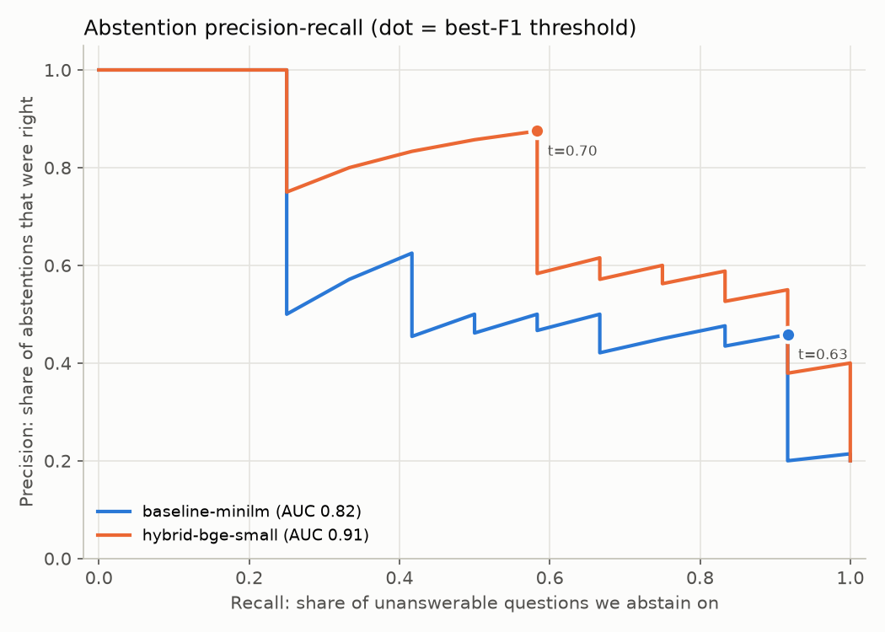

# Document Intelligence Chatbot

## 1. What it does

A local Retrieval-Augmented Generation (RAG) chatbot for PDFs. It parses PDFs (OCR fallback for scanned pages, with page and bounding-box positions kept on every chunk), retrieves relevant chunks with hybrid keyword + embedding search, and has Google Gemini answer from those chunks only, citing file, page and position. It abstains with "I don't have enough information" when retrieval confidence is low.

The project also includes an evaluation harness. It uses 60 hand-labelled questions over public FDA drug labels to measure retrieval quality and abstention. Retrieval choices and the abstention threshold are picked from those numbers rather than guessed.

**Headline result** (48 answerable + 12 unanswerable questions; details in [Results](#results)): switching from the original MiniLM dense search to hybrid BM25 + `bge-small` retrieval raised MRR@10 from **0.57 to 0.80** (+0.23, 95% CI +0.11 to +0.35). The rate of putting the right chunk first (Hit@1) went from **0.42 to 0.71**.

## 2. Tools and libraries (and why)

| Tool | Why |
|---|---|
| **PyMuPDF** | Fast text extraction *with* block coordinates, and renders pages to images for OCR, so no separate poppler install is needed. |
| **Tesseract** (`pytesseract`) | Free, local OCR for scanned/image-only pages; returns word positions too. |
| **sentence-transformers** | Runs HuggingFace embedding and cross-encoder models locally (Apple Silicon GPU via `mps`). |
| **BAAI/bge-small-en-v1.5** | Default embedding model: beat the original `all-MiniLM-L6-v2` in the eval (+0.14 MRR), scored at least as well as the larger `bge-base`, and reads 512 tokens (MiniLM truncates at 256, which cut off part of 46% of our chunks). |
| **rank-bm25** | Keyword search. Catches exact terms like drug names, doses and section titles that embeddings blur. |
| **FAISS** | Fast vector similarity search; `IndexFlatIP` on normalized vectors = exact cosine search. |
| **Google Gemini** (`google-genai`, `gemini-3.8-flash`) | Generates the final answer; has a free tier. Pinned version for reproducibility. |
| **rapidfuzz** | Fuzzy matching of evidence quotes to chunks, tolerant of OCR typos. |
| **pytest + GitHub Actions** | Unit tests, label-integrity tests, and a retrieval regression test on every push. |
| **matplotlib** | Precision-recall curve for picking the abstention threshold. |

## 3. File structure

```
src/docintel/
  __init__.py        package marker
  config.py          data paths, chunk sizes, default model, picks mps/cuda/cpu
  ingest.py          Step 1: PDF -> text blocks with page + bounding box (OCR fallback)
  chunking.py        Step 2: blocks -> ~120-word overlapping chunks that keep their regions
  build_index.py     Step 3: embed chunks, save FAISS index + model name (manifest)
  retrieval.py       dense / BM25 / hybrid (RRF) / rerank retrievers + named configs
  pipeline.py        runs steps 1-3 in one command
  search.py          retrieval-only demo (no LLM) for inspecting rankings
  chat.py            the chatbot: retrieve -> abstain or ask Gemini -> cite sources
  evaluation.py      metrics: evidence matching, Hit@k, MRR, PR curve, CV, bootstrap CIs
eval/
  corpus/            5 DailyMed drug-label PDFs + 1 simulated scanned PDF (the eval corpus)
  source_pdfs/       the original label used to make the simulated scan
  download_corpus.py DailyMed set IDs/versions of every corpus PDF; re-downloads them
  make_scanned_pdf.py turns 4 label pages into an image-only "scan" (skew, blur, noise)
  questions.json     60 questions: answer, source file and evidence quotes (12 unanswerable)
  run_eval.py        runs every retrieval config, writes eval/results/
  results/results.md   comparison table (below)
  results/results.json all metrics, thresholds, PR curves, per-question ranks
  results/pr_curves.png abstention precision-recall curves
  results/labels_review.md every label + where its evidence was found, for human review
tests/
  conftest.py        shared fixture: parsed + chunked eval corpus
  test_ingest.py     digital parsing, real OCR on an image-only PDF, bbox units, line grouping
  test_chunking.py   chunk size, overlap, page ranges, regions, edge cases
  test_retrieval.py  BM25, dense, RRF, hybrid, rerank, save/load, model-mismatch guard
  test_evaluation.py metrics, threshold picking, CV, bootstrap
  test_eval_labels.py every label's evidence exists in the parsed corpus (incl. OCR'd PDF)
  test_retrieval_regression.py (slow) baseline + hybrid must stay above metric floors
.github/workflows/ci.yml  installs Tesseract + CPU PyTorch, runs fast then slow tests
pyproject.toml     makes src/docintel installable (`pip install -e .`) + pytest config
requirements.txt   pinned package versions
.env.example       template for GEMINI_API_KEY (placeholder only)
data/              your own PDFs and generated files (not tracked in git)
```

## 4. Setup

```bash
brew install tesseract                      # OCR engine (macOS)
conda create -n doc-intelligence-chatbot python=3.11 -y
conda activate doc-intelligence-chatbot
pip install -r requirements.txt
pip install -e .                            # makes `import docintel` work
cp .env.example .env                        # then put your Gemini API key in .env
```

## 5. How to run

Chat with your own PDFs:

```bash
cp ~/Downloads/*.pdf data/raw_pdfs/         # any PDFs you want to ask about
python -m docintel.pipeline                 # parse -> chunk -> embed + index
python -m docintel.chat                     # ask questions; 'quit' to exit
python -m docintel.search                   # (optional) see raw rankings, no LLM
```

Reproduce the evaluation (no API key needed; downloads ~1.8 GB of models on first run, mostly the reranker):

```bash
python eval/run_eval.py                     # all 7 configs, a few minutes on an M4 Pro
python eval/run_eval.py --configs baseline-minilm hybrid-bge-small
```

Tests:

```bash
pytest                                      # 27 fast tests (~1 s once the corpus is cached)
pytest -m slow                              # retrieval regression test (downloads models)
```

## Results

Corpus: 5 FDA drug labels from DailyMed (Lipitor, Zoloft, Zestril, Jantoven/warfarin, metformin; 215 pages) plus a simulated 4-page scan of an amoxicillin label, giving 553 chunks. Questions: 48 answerable (8 per document) and 12 unanswerable (3 off-topic or about a drug not in the corpus, 2 near-misses about drugs that only appear as interaction mentions, 7 about information the labels don't contain, like prices or veterinary use).

| Config | Hit@1 | Hit@4 | Hit@10 | MRR@10 [95% CI] | ΔMRR vs baseline [95% CI] | Abstain F1 (in-sample / 5-fold CV) | AUC | Answered w/ evidence | ms/query |
|---|---|---|---|---|---|---|---|---|---|
| baseline-minilm | 0.42 | 0.83 | 0.88 | 0.57 [0.46, 0.68] | — | 0.61 / 0.50 | 0.82 | 0.69 | 5 |
| bm25 | 0.58 | 0.83 | 0.94 | 0.71 [0.60, 0.81] | +0.14 [+0.01, +0.27] | 0.76 / 0.70 | 0.85 | 0.81 | 0 |
| dense-bge-small | 0.56 | 0.88 | 1.00 | 0.71 [0.61, 0.80] | +0.14 [+0.05, +0.23] | 0.70 / 0.50 | 0.91 | 0.85 | 7 |
| dense-bge-base | 0.50 | 0.81 | 0.98 | 0.66 [0.56, 0.76] | +0.09 [-0.00, +0.19] | 0.69 / 0.62 | 0.90 | 0.73 | 8 |
| **hybrid-bge-small** (default) | **0.71** | 0.88 | 0.98 | **0.80** [0.70, 0.88] | **+0.23** [+0.11, +0.35] | 0.70 / 0.50 | 0.91 | 0.85 | 7 |
| hybrid-bge-small+rerank | 0.58 | 0.85 | 0.94 | 0.72 [0.62, 0.82] | +0.15 [+0.03, +0.26] | 0.58 / 0.48 | 0.78 | 0.75 | 581 |
| hybrid-bge-base+rerank | 0.58 | 0.92 | 0.94 | 0.72 [0.62, 0.82] | +0.15 [+0.03, +0.27] | 0.56 / 0.45 | 0.73 | 0.79 | 603 |

*Hit@4* = the right chunk is among the 4 sent to the LLM. *Answered w/ evidence* = an answerable question passes the abstention threshold **and** has its evidence in those 4 chunks. *AUC* = how well the confidence score separates answerable from unanswerable questions (1.0 = perfectly). Timings are on an M4 Pro with the `mps` GPU.

What the numbers say:

- **Hybrid search scored best, and clearly beats the baseline** (+0.23 MRR, CI +0.11 to +0.35). Over `bge-small` alone, adding BM25 gave +0.09 MRR (CI −0.01 to +0.19). That points the same way, but the interval crosses zero, so this set is too small to prove BM25 adds value on top of `bge-small`.
- **The cross-encoder reranker did not help here.** Compared with hybrid it changed MRR by −0.08 (CI −0.18 to +0.02, so not clearly worse, but no gain) at ~90× the latency. It also gave near-miss unanswerable questions very high scores: "omeprazole dose for heartburn" scored 0.99 because omeprazole is mentioned. So it is not the default.
- **The bigger embedding model wasn't better.** `bge-base` scored −0.05 MRR vs `bge-small` (CI −0.11 to +0.02).
- **OCR'd text is retrievable, but the scanned PDF is the weak spot.** On its 8 questions, hybrid ranks the right chunk first for 5 (baseline: 2) but has it in the top 4 for only 6, while the baseline has all 8 in the top 4. BM25 likely suffers from OCR typos ("pyloriinfection") that break exact-word matches.
- **Abstention from retrieval scores alone is weak.** The chosen threshold (0.702) abstains on 7 of 12 unanswerable questions with 87.5% precision while still answering 47 of 48 answerable ones. However, the cross-validated F1 is only 0.50, so the threshold is fragile. The LLM prompt is the second line of defense: in a manual test, a near-miss question that passed the threshold still got "I don't have enough information" from Gemini.



### Limitations (read before quoting numbers)

- **Small eval set.** 48 answerable questions, so one question moves Hit@1 by ~2 points. The 95% confidence intervals above are the honest error bars; differences inside them are noise.
- **Labels by one annotator, pooled at depth 1.** Questions and evidence quotes were written from the label text. They were then widened by judging each config's top-ranked chunk: 33 alternate quotes were added where a chunk answered in different words. A second review then removed 2 of them (a table heading, and a "recent changes" entry that named a warning without saying what it was), replaced one quote that didn't name the answer, and corrected one expected answer. Relevant chunks deeper in the rankings may still be unlabelled, so Hit@4/Hit@10 are lower bounds. Every label is listed in [`eval/results/labels_review.md`](eval/results/labels_review.md).
- **The scan is simulated.** It's a degraded rendering of a real label, because the FDA archive blocks scripted downloads of real scans.
- **Threshold is corpus-specific.** It was tuned on drug labels with `bge-small`. On other documents, re-run the eval or pass `--threshold`.
- **Layout is kept, not yet used for ranking.** Bounding boxes are stored and shown in citations, but chunking is word-window based. On two-column pages, PyMuPDF sometimes returns bullet glyphs as separate blocks, out of reading order.
- **Answer quality is not scored yet.** The eval measures retrieval and abstention, not whether Gemini's final wording is correct.

## 6. How it was built

1. **Original prototype.** Four scripts (parse → chunk → MiniLM + FAISS → Gemini) tested on a few personal PDFs, with no tests or measurements.
2. **Review.** A review found that bounding boxes were dropped at chunking, OCR boxes were in pixels while digital boxes were in points, there were no tests, and nothing measured accuracy.
3. **Restructure.** Turned the scripts into the installable `docintel` package and added a conda env, pinned requirements, pytest and GitHub Actions CI. Also fixed the bbox problems, saved the model name with the index, added real exponential backoff (429/5xx), and made citations come from retrieval rather than the LLM's text.
4. **Eval corpus.** Downloaded 5 DailyMed labels, made a simulated scan of a 6th, wrote 60 questions with evidence quotes, and added a test that every quote exists in the parsed corpus.
5. **Eval harness.** Added Hit@k, MRR, bootstrap CIs, a paired comparison against the baseline, and an abstention precision-recall curve with a cross-validated F1.
6. **Label audit.** Pooled the top result from every config, judged each one by hand, and added alternate wordings. Before this, every config's score was badly undercounted (e.g. baseline Hit@1 0.23 → 0.46).
7. **Retrieval experiments.** Compared BM25, `bge-small`, `bge-base`, hybrid RRF and cross-encoder reranking, kept the best (hybrid `bge-small`), and set the abstention threshold from the PR curve.
8. **End-to-end check.** Ran the chatbot on the public corpus against the real Gemini API.
9. **Second label review.** A human review fixed 4 labels where the evidence quote didn't actually contain the answer. All scores dropped slightly (hybrid MRR 0.83 → 0.80), and the hybrid-vs-`bge-small` gain stopped being clearly significant. The numbers above are after this fix.

## 7. Key concepts (interview-ready)

- **RAG**: retrieve relevant text first, then make the LLM answer from it. This grounds answers in your documents and makes them checkable.
- **Chunking & overlap**: chunks must be small enough to be about one thing, but each embedding model has a max input length. MiniLM silently truncates at 256 tokens, and 46% of these chunks were longer.
- **Dense vs. sparse retrieval**: embeddings match meaning ("blood thinner" ≈ "anticoagulant"); BM25 matches exact words (drug names, "2,550 mg"). Each fails where the other succeeds.
- **Reciprocal Rank Fusion**: merge ranked lists by `sum 1/(60 + rank)`. Uses only ranks, so you never compare a cosine score to a BM25 score.
- **Bi-encoder vs. cross-encoder**: a bi-encoder embeds query and document separately (fast, used for search). A cross-encoder reads the pair together (slower, often more precise). "Often" isn't "always": measure it, as this eval shows.
- **Hit@k and MRR**: Hit@k is whether the right chunk is in the top k. MRR is the average of 1/rank of the first right chunk, which rewards putting it first.
- **Abstention as classification**: "should I refuse?" is a binary decision. Sweep the threshold, plot precision vs. recall, pick a point, and cross-validate it, because picking and scoring on the same data is optimistic.
- **Confidence intervals & paired tests**: with 48 questions, bootstrap the per-question scores. Compare systems on the *same* questions (paired) before claiming one is better.
- **Evaluation pooling**: labels written up front miss alternate correct passages. Judging the pooled top results of all systems (as TREC does) fixes this without favoring any single system.
- **OCR coordinate systems**: images are in pixels at some DPI, PDFs are in points (1/72 inch), so convert with `points = pixels × 72 / dpi`.
- **Reproducibility**: pin package and model versions, commit the eval corpus, and record which model built an index.
